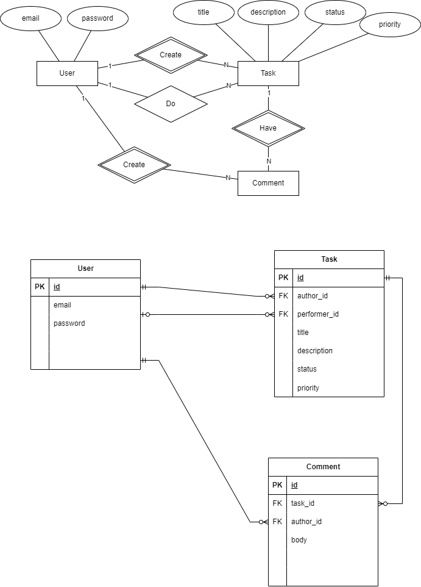

# Task Management System

## Run

```bash
./mvnw clean package
cp ./target/*.jar ./src/main/docker
cd  ./src/main/docker
docker-compose down
docker rmi docker-spring-boot-postgres:latest
docker-compose up
```

Swagger UI
http://localhost:8080/swagger-ui/index.html

|            | GET /users | POST /users | PUT /users | GET /users/{id} | DELETE /users/{id} | PATCH /users/{id}                     |
|------------|------------|-------------|------------|-----------------|--------------------|---------------------------------------|
| ROLE_ADMIN | All        | All         | All        | All             | All                | All (email, rawPassword, authorities) |
| ROLE_USER  | All        | -           | -          | All             | -                  | Current user only (email,rawPassword) |


|            | GET /tasks | POST /tasks | PUT /tasks | GET /tasks/{id} | DELETE /tasks/{id} | PATCH /tasks/{id}                                                                                                  |
|------------|------------|-------------|------------|-----------------|--------------------|--------------------------------------------------------------------------------------------------------------------|
| ROLE_ADMIN | All        | All         | All        | All             | All                | All (title, description, status, priority, authorId, performerId)                                                  |
| ROLE_USER  | All        | All         | -          | All             | -                  | Current user is author (title, description, status, priority, performerId)<br/> Current user is performer (status) |


|            | POST /users                 | GET /users/{id} | DELETE /users/{id} |
|------------|-----------------------------|-----------------|--------------------|
| ROLE_ADMIN | All (author - current user) | All             | All                |
| ROLE_USER  | All (author - current user) | All             | -                  |

Запуск PostgreSQL для локальной разработки
```bash
docker compose -f .\docker-compose-postgresql.yaml up -d
```

